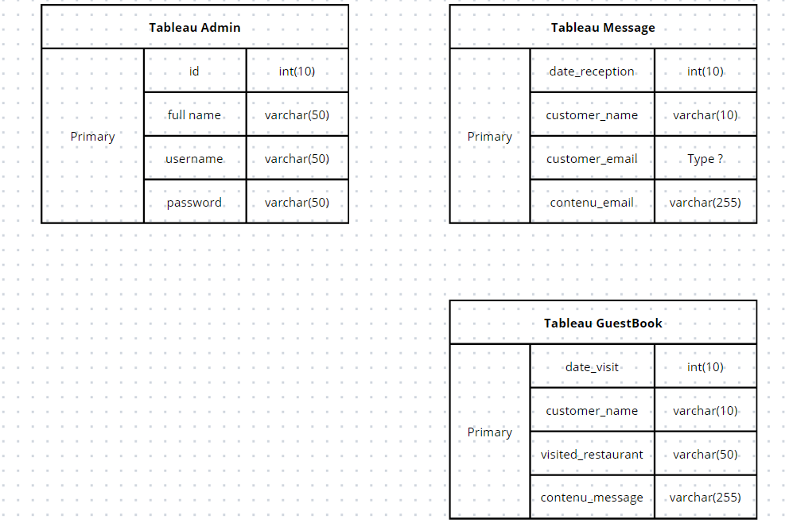

# Restaurant-2.0

# Restaurant 2.0

Type of challenge: **learning**

Duration: **5 days**

Team challenge: **solo**

## Learning objectives

At the end of this challenge, depending on what you completed, you should be able to:

- Make a Form and manage messages via an interface
- View and manage a guestbook
- Display an image gallery dynamically
- Use an API
- Deploy a project in php

## The mission

Once upon a time **I made a website** for a restaurant franchise. Now and after hearing about the wonderful work you did the owner is calling you back to implement new features and **improve the website**.

Sadly, he can only pay you for a week of work, which **won’t be enough time** to implement all his ideas. Hopefully, he’s ready to make compromises, you have to **implement as much as you can** in the given time.

## Instructions

- take back your old [project](https://github.com/becodeorg/BXL-Swartz-4-27/blob/master/1.The-Field/6.Bootstrap/restaurant.adoc)
- implement at least one new feature
- improve the design (if you have time)
- use whatever technology you want

| Note | You don’t have to fill any form for this project, as it’s a learning challenge. However, if you feel it could unlock **badges** you can try to claim them with it. |
| ---- | ------------------------------------------------------------------------------------------------------------------------------------------------------------------ |
|      |                                                                                                                                                                    |

### Thinking About our DB

#### Back office

One of the idea the owner had was to implement a "Back office" to the website. The objective is to receive all the messages from the form on a single page to facilitate the work of marketing and communication. From this interface you can **view** the messages and **delete** them.

Something like that

#### Guest book

The owner would like to have a new **guest book** page to receive comments, kind words or advice from the customers. However, it ideally need to be made with the **google sheet API** to allow the owner to check everything directly from his _google account_.

**If you find that it is too early to take an interest in API's you can proceed as for the previous form and use your database.**

The form should at least contain:

- customer name
- visited restaurant
- visit date
- comment (optional input)

#### Next Thing on time Line

**google sheet API**  For guestbook && Message ? 

#### Deploy

This is the opportunity to deploy your project. As you have probably noticed, github does not allow php hosting. There are free solutions. It's up to you to find them and share them with your colleagues!

### ToDo / ToWatch

- [add composer on a docker image](https://tinyurl.com/yxda5q7o)
- [google sheet API](https://developers.google.com/sheets/api/quickstart/php)
- Use only one page to manage messages, guestbook and gallery
      -Gallery (uplaod images + display 3 by 3)
- Use only one page to manage messages and the guestbook

